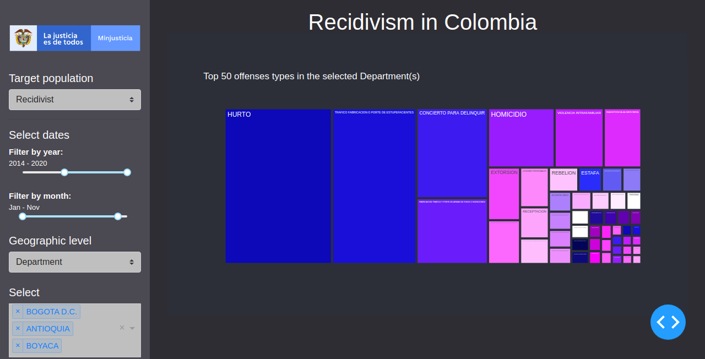
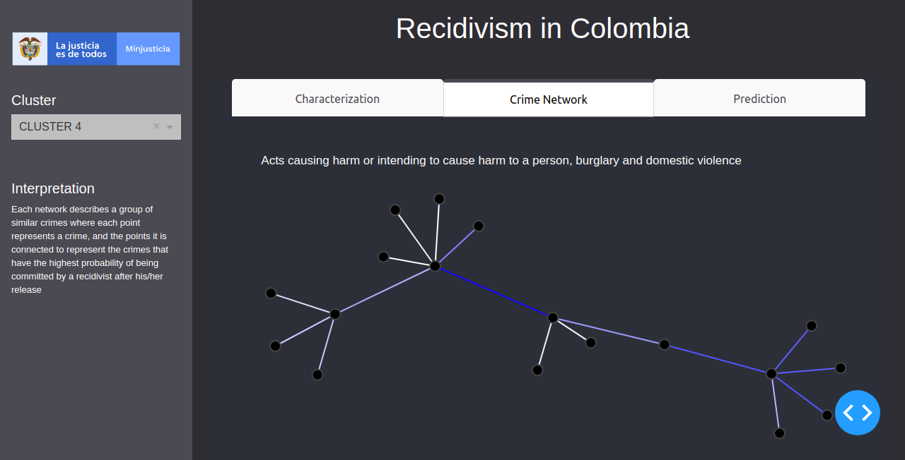

# MinJusticia App - Recidivism in Colombia

Final project for the **2020 Data Science for All (DS4A) Colombia 2.0 program**.  

Team:  

| Name            |            Email           |                             Github | 
|-----------------|:--------------------------:|-----------------------------------:|
| Alejandro Coca-Castro    | acocac@gmail.com |     https://github.com/acocac |
| David Hoyos García | davidhoga@gmail.com |         https://github.com/davidhoga89 |
| Mario A. Velázquez |  clikcmario@gmail.com  | https://github.com/mavelasquez | 
| Nicolás Viana |  nicolasviana@gmail.com  | https://github.com/nicolasvianavega | 

### Introduction
Recidivism is a measure of a former prisoner's likelihood to be re-arrested, re-convicted, or returned to prison with or without a new sentence during a three-year period following the prisoner's release. It has been used to study the performance and effectiveness of privately and publicly managed prisons.

The main objective of the project is to approximate to a better “characterization of the recidivist population of the Penitentiary and Prison System in Colombia”. 
This information is key to have inputs for the formation and monitoring of the criminal policy of the Colombian State in its phases of prevision and tertiary criminalization. 

### Application Overview 
The user can explore the main findings of the project by navigating in three Tabs components, Characterization, Crime Network and Prediction. A brief overview of each component is provided as follows. 

#### Characterization
* The user will be able to geographically visualize the \% con convicts on each department of the country. It also has a yer/month and target population filters that will improve the data visualisation.\\
* This section additionally displays interesting plots about the convict population that is targeted through the section filters.\\
* These plots show the gender distribution as well as convict demographics and sentence length distributions. Another interesting graph that is found in this section is the top 50 offenses types committed in the selected department.
* This section provides useful information that will allow the user to better understand the characteristics of the recidivist and non recidivist population across the country.

*CHARACTERIZATION - DEPARTMENT LEVEL*  

*CHARACTERIZATION - NATIONAL LEVEL*  

#### Crime network  
* This section allows the user to explore the clusters that were created during the feature engineering of this project:
* It allows to explore cluster derived from a network graph analysis targeting the offenses types.  
* Selecting a cluster from the drop down menu, will show the user the network of the crimes that a re linked together. The color of the link indicates how strong is the relationship between both crimes.

#### Prediction  

* The prediction tab was built to give the user predictions of the probability of a convict to be recidivist/non recidivist.

### Documentation
A detailed step by step guide is under preparation. Meanwhile, the folder notebooks and report (see `notebooks` and `report`) contain jupyter notebook files of the EDA and modeling exercises and the final report delivered as part of this challenge.

### Acknowledgements
The team acknowledges MinJusticia for providing the database analysed in this challenge. This development would not have been possible without the assistance of multiple organizations including MinTIC and CorrelationOne.
